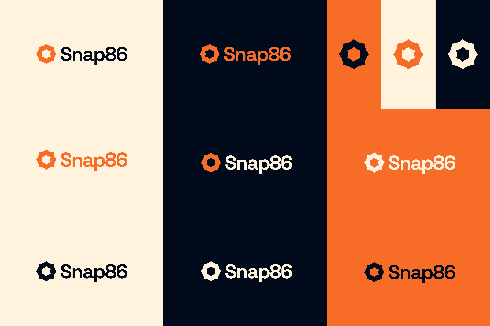
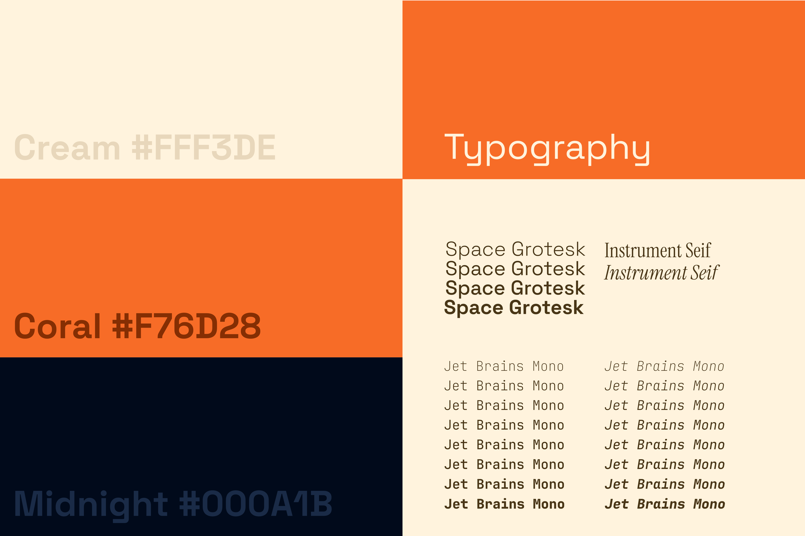

# Snap86 Brand Guidelines

This repository is the **Single Source of Truth** for Snap86 press and brand materials.

---

## Logo

The Snap86 logo features a distinctive gear-shaped icon alongside the wordmark. Use the appropriate variant based on the background context.

### Logo Suite

| Variant | File | Usage |
|---------|------|-------|
| Default | [snap86-logo-default.svg](logos/snap86-logo-default.svg) | Icon on light backgrounds |
| Dark | [snap86-logo-dark.svg](logos/snap86-logo-dark.svg) | Icon on dark backgrounds |
| Light | [snap86-logo-light.svg](logos/snap86-logo-light.svg) | Icon on colored backgrounds |
| Full Color (Default) | [snap86-logo-full-color-default.svg](logos/snap86-logo-full-color-default.svg) | Primary use on light backgrounds |
| Full Color (Light) | [snap86-logo-full-color-light.svg](logos/snap86-logo-full-color-light.svg) | On dark backgrounds |
| Full Dark Light | [snap86-logo-full-dark-light.svg](logos/snap86-logo-full-dark-light.svg) | Alternative dark variant |
| Monochrome (Default) | [snap86-logo-full-mono-deafult.svg](logos/snap86-logo-full-mono-deafult.svg) | Single-color applications |
| Monochrome (Light) | [snap86-logo-full-mono-light.svg](logos/snap86-logo-full-mono-light.svg) | Light monochrome variant |

### Logo Variations

---

## Color Palette

| Color | Hex Code | Usage |
|-------|----------|-------|
| **Cream** | `#FFF3DE` | Light backgrounds, secondary elements |
| **Coral** | `#F76D28` | Primary brand color, accents, icons |
| **Midnight** | `#000A1B` | Dark backgrounds, text |

---

## Typography

### Primary Font: Space Grotesk
Used for headings, titles, and prominent UI elements.

### Secondary Font: Instrument Seif
Used for body text and supporting content.

### Monospace Font: JetBrains Mono
Used for code, technical content, and data displays.

---

## Assets

- **[Brand Kit](brandkit/)** – Color palette and logo variations reference
- **[Logos](logos/)** – Complete logo suite in SVG format

---

## Tools

- **[Asset Generator](tools/logo-generator/index.html)** – a simple tool to generate branded PNGs from SVGs with custom backgrounds and padding.

## Usage Guidelines

- Always maintain clear space around the logo
- Do not distort, rotate, or alter logo colors outside of provided variants
- Use Coral (`#F76D28`) as the primary accent color
- Pair Midnight (`#000A1B`) with Cream (`#FFF3DE`) for high contrast
